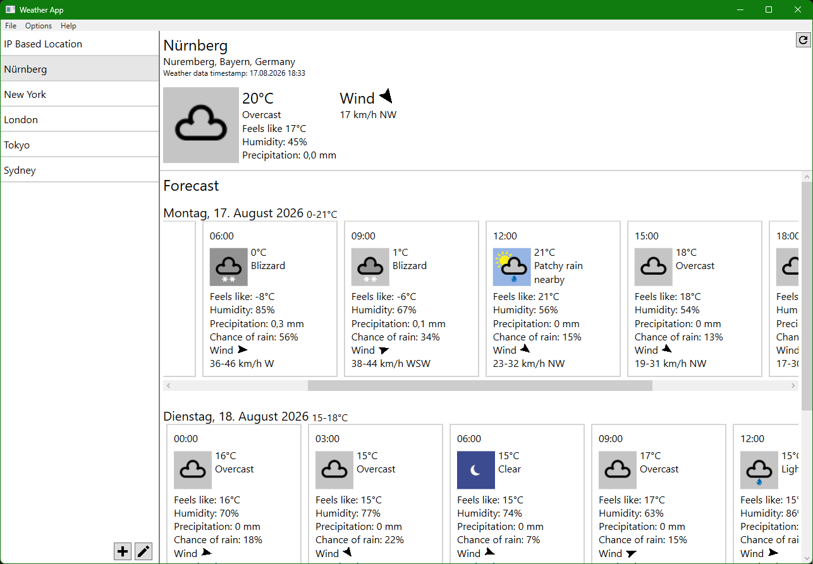

# WeatherApp

A weather app built using WPF and C# to display current weather data.
 The primary goal of this project was to implement a clean software architecture using the MVVM (Model-View-ViewModel) pattern and handling asynchronous API requests.

## Key features & Technologies
- C# & WPF: Building a responsive desktop UI.
- MVVM Pattern: Strict separation of UI and business logic for better maintainability.
- REST API Integration: Fetching real-time weather data asynchronously via HttpClient from wttr.in (JSON format).
- Data Binding & Commands: Handling user interactions and UI updates cleanly.

## Installation

### Portable App

- Download the zip-file from the [releases page](https://github.com/MerlinDeadleft/WeatherApp/releases)
- Unzip to any directory you want (if the app is placed in a folder called "Program Files" it needs to be run as an administrator)
- Run WeatherApp.exe

### Self Compiled

- Download the source code
- Open the project in the IDE of your choice
- Build the project